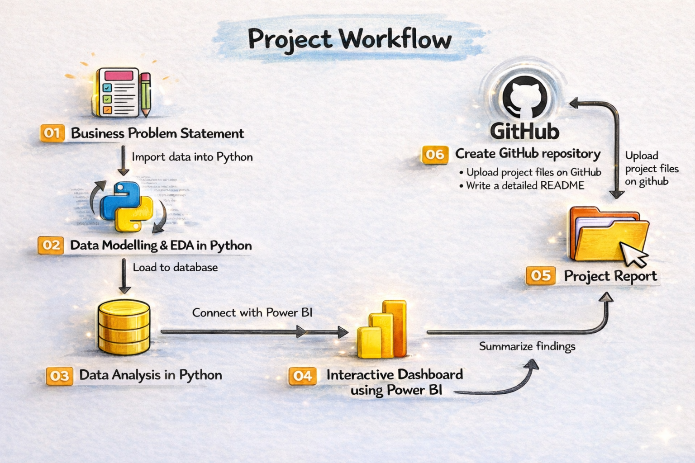

---

# 🍔 Swiggy Data Analysis Project (Python + Power BI) 

  

An end-to-end **Swiggy dataset cleaning and analysis project**, where raw multi-table data was cleaned, formatted, and prepared for analytics. The cleaned dataset was then used to build an interactive **Power BI dashboard** for generating business insights.

---

# 🌐 Dashboard

> ⚠️ *Note:* Map is not visible as we are on free powerbi version

---

## 📌 Project Overview

This project focuses on:

* ✅ Data cleaning and preprocessing of Swiggy dataset
* ✅ Handling missing values across all tables
* ✅ Standardizing table formats and column names
* ✅ Preparing clean datasets for reporting
* ✅ Power BI dashboard development and insights generation

**Workflow followed:**

Data Exploration → Null Handling → Formatting → Storing Clean Data → Dashboard Reporting

---

## 🎯 Business Objective

Swiggy-like platforms generate large datasets containing:

* Food items
* Menus and pricing
* Restaurants
* Users
* Orders

The goal is to convert these raw datasets into a clean, analysis-ready format to answer business questions such as:

* Which cities generate the highest sales?
* Which customer segment contributes the most revenue?
* What is the veg vs non-veg performance?
* What are the order trends over time?

---

## 📊 Dataset Files

The dataset used in this project consists of **multiple independent files**, each representing a different business entity.
These files were cleaned, formatted, and analyzed individually before being used together for reporting and dashboard creation.

| File Name          | Entity          | Columns                                                                                 |
| ------------------ | --------------- | --------------------------------------------------------------------------------------- |
| **food.csv**       | 🍲 Food         | `f_id`, `item`, `veg_or_non_veg`                                                        |
| **menu.csv**       | 📋 Menu         | `menu_id`, `r_id`, `f_id`, `cuisine`, `price`                                           |
| **orders.csv**     | 📝 Orders       | `order_date`, `sales_qty`, `sales_amount`, `currency`, `user_id`, `r_id`                |
| **order_type.csv** | 🛍️ Orders Type | `order_id`, `type`                                                                      |
| **restaurant.csv** | 🍴 Restaurant   | `id`, `name`, `country`, `city`, `rating`, `rating_count`, `cuisine`, `link`, `address` |
| **users.csv**      | 👥 Users        | `user_id`, `name`, `age`, `gender`, `marital_status`, `occupation`                      |

---

## 🧹 Data Cleaning & Processing Steps

### 1️⃣ Initial Data Exploration

* Loaded datasets
* Checked shape, datatypes, duplicates, and data quality

### 2️⃣ Null Handling

* Identified missing values in each table
* Applied appropriate null-handling strategies to avoid data loss

### 3️⃣ Formatting & Standardization

* Renamed columns for consistency
* Removed unnecessary columns and tables
* Ensured correct datatypes (dates, numeric, text)

### 4️⃣ Storing Clean Dataset

* Saved cleaned datasets for further analysis and BI reporting

---

## 📊 Power BI Dashboard

The dashboard includes:

* Overview KPIs (Orders, Users, Sales, Ratings)
* Veg / Non-Veg / Other sales performance
* Top customers contribution
* Sales trends by year
* City-wise sales and orders performance
* User demographic insights
* Map view showing geographical spread

📄 Dashboard screenshots are available in **Dashboard_pdf.pdf**

---

## 🔍 Key Insights

* 🥗 **Vegetarian items contributed ~122M sales**, higher than non-vegetarian (~106M)
* 👑 **Top 10% customers contribute ~80% of total sales**
* 🏙️ **Tirupati recorded the highest order amount (~43M)**
* 📈 Strong year-over-year sales growth with visible peak years

(Insights summary available in Dashboard)

---

## ⭐ Summary

* Cleaned and analyzed a multi-table Swiggy dataset using Python (Pandas) with proper null handling and data standardization
* Performed EDA to extract customer, restaurant, and sales KPIs
* Built an interactive Power BI dashboard highlighting city-wise sales, veg vs non-veg performance, top customers, and yearly trends
* Identified key business insights including vegetarian dominance in revenue and high contribution from top customers

---

## 🧑‍💻 Author

**Nayan Mishra**

Data Analyst | SQL | Power BI | Python | Excel

---

